# Kai Health Assistant - Decoupled System Architecture

## System Overview

The Kai Health Assistant is a comprehensive health information system for Sierra Leone, consisting of two main applications:

1. **WhatsApp Bot Service** - Node.js/TypeScript service that bridges WhatsApp messages to Geneline-X AI
2. **Admin Dashboard** - Next.js web application for managing the bot, users, and health content

Both applications share a common Supabase database for data persistence and synchronization.

---

## High-Level Architecture (Decoupled Design)

```mermaid
graph TB
    subgraph "External Users"
        USERS["👥 WhatsApp Users<br/>(Citizens of Sierra Leone)"]
        ADMINS["👨‍💼 Admin Users<br/>(Health Workers, Supervisors)"]
    end

    subgraph "Client Layer"
        WA["📱 WhatsApp<br/>Messaging Platform"]
        BROWSER["🌐 Web Browser<br/>(Admin Dashboard)"]
    end

    subgraph "Application Layer"
        direction TB
        
        subgraph "WhatsApp Bot Service (Node.js)"
            direction LR
            BOT_API["🔌 API Server<br/>(Express)"]
            BOT_CORE["⚙️ Core Application<br/>(Orchestrator)"]
            
            subgraph "Message Processing Pipeline"
                WA_CLIENT["WhatsApp Client<br/>(whatsapp-web.js)"]
                MSG_HANDLER["Message Handler"]
                QUEUE_MGR["Queue Manager<br/>(Rate Limiting)"]
                MSG_WORKER["Message Worker"]
            end
            
            subgraph "AI Agent Framework"
                AGENT_LOOP["Agent Loop<br/>(Multi-step Reasoning)"]
                CONV_HISTORY["Conversation<br/>Memory"]
                TOOLS["Agent Tools"]
            end
            
            subgraph "Services Layer"
                VOICE_SVC["Voice Service<br/>(Transcription)"]
                LOCATION_SVC["Location Service<br/>(Health Centers)"]
                BROADCAST_SVC["Broadcast<br/>Scheduler"]
                CONTENT_GEN["AI Content<br/>Generator"]
            end
        end
        
        subgraph "Admin Dashboard (Next.js)"
            direction LR
            DASH_UI["🖥️ Dashboard UI<br/>(React Components)"]
            DASH_API["API Routes<br/>(Next.js)"]
            DASH_ACTIONS["Server Actions<br/>(Data Layer)"]
        end
    end

    subgraph "Data Layer"
        DB[(🗄️ Supabase PostgreSQL<br/><br/>• users<br/>• messages<br/>• escalations<br/>• health_topics<br/>• broadcasts<br/>• special_contacts<br/>• bot_settings)]
    end

    subgraph "External Services"
        AI["🤖 Geneline-X AI<br/>(LLM API)"]
        VOICE_API["🎤 Voice Processing<br/>(Transcription API)"]
    end

    %% User connections
    USERS --> WA
    ADMINS --> BROWSER

    %% Client to Application
    WA <--> WA_CLIENT
    BROWSER <--> DASH_UI

    %% WhatsApp Bot internal flow
    WA_CLIENT --> MSG_HANDLER
    MSG_HANDLER --> QUEUE_MGR
    QUEUE_MGR --> MSG_WORKER
    MSG_WORKER --> AGENT_LOOP
    AGENT_LOOP --> TOOLS
    AGENT_LOOP --> CONV_HISTORY
    MSG_WORKER --> WA_CLIENT
    
    %% Services connections
    MSG_WORKER --> VOICE_SVC
    MSG_WORKER --> LOCATION_SVC
    TOOLS --> LOCATION_SVC
    BROADCAST_SVC --> WA_CLIENT
    CONTENT_GEN --> DB
    
    %% Bot API connections
    BOT_API --> WA_CLIENT
    BOT_API --> QUEUE_MGR
    BOT_CORE --> WA_CLIENT
    BOT_CORE --> QUEUE_MGR
    BOT_CORE --> MSG_HANDLER
    BOT_CORE --> MSG_WORKER
    BOT_CORE --> BROADCAST_SVC

    %% Dashboard connections
    DASH_UI --> DASH_API
    DASH_API --> DASH_ACTIONS
    DASH_ACTIONS --> DB

    %% Database connections
    MSG_HANDLER --> DB
    MSG_WORKER --> DB
    AGENT_LOOP --> DB
    BROADCAST_SVC --> DB
    VOICE_SVC --> DB
    LOCATION_SVC --> DB

    %% External service connections
    AGENT_LOOP --> AI
    VOICE_SVC --> VOICE_API
    CONTENT_GEN --> AI

    %% Admin Dashboard to Bot API
    DASH_ACTIONS -.HTTP API.-> BOT_API

    style USERS fill:#FFE66D,stroke:#333,color:#000
    style ADMINS fill:#FFE66D,stroke:#333,color:#000
    style BOT_CORE fill:#5B7BFF,stroke:#333,color:#fff
    style AGENT_LOOP fill:#FF6B6B,stroke:#333,color:#fff
    style DB fill:#4ECDC4,stroke:#333,color:#fff
    style AI fill:#95E1D3,stroke:#333,color:#000
    style DASH_UI fill:#F38181,stroke:#333,color:#fff
```

---

## Detailed Component Architecture

### 1. WhatsApp Bot Service - Hexagonal Architecture

```mermaid
graph TB
    subgraph "External Systems (Adapters)"
        WA_EXT["WhatsApp Platform"]
        DB_EXT["Supabase Database"]
        AI_EXT["Geneline-X AI API"]
        VOICE_EXT["Voice API"]
    end

    subgraph "Ports Layer (Interfaces)"
        direction LR
        PORT_MSG["🔌 MessageSender<br/>Port"]
        PORT_PROC["🔌 MessageProcessor<br/>Port"]
        PORT_DATA["🔌 DataRepository<br/>Port"]
        PORT_ESC["🔌 EscalationDetector<br/>Port"]
        PORT_VOICE["🔌 VoiceProcessor<br/>Port"]
    end

    subgraph "Domain Core (Business Logic)"
        direction TB
        CORE["📦 Use Cases<br/><br/>• handleIncomingMessage<br/>• processQueuedMessage<br/>• sendResponse<br/>• detectEscalation<br/>• processBroadcast"]
        TYPES["🔷 Domain Types<br/><br/>• Message<br/>• User<br/>• Escalation<br/>• AgentResult<br/>• Broadcast"]
        EVENTS["📡 Event System<br/><br/>• MESSAGE_RECEIVED<br/>• ESCALATION_DETECTED<br/>• RESPONSE_SENT"]
        
        CORE --- TYPES
        CORE --- EVENTS
    end

    subgraph "Adapter Implementations"
        direction LR
        ADAPT_WA["WhatsApp<br/>Adapter"]
        ADAPT_AGENT["Agent Loop<br/>Adapter"]
        ADAPT_DB["Supabase<br/>Adapter"]
        ADAPT_ESC["Escalation<br/>Adapter"]
        ADAPT_VOICE["Voice<br/>Adapter"]
    end

    subgraph "Application Orchestrator"
        APP["⚙️ Application<br/><br/>• Initialize components<br/>• Wire dependencies<br/>• Start/stop services"]
    end

    %% Port connections
    CORE --> PORT_MSG
    CORE --> PORT_PROC
    CORE --> PORT_DATA
    CORE --> PORT_ESC
    CORE --> PORT_VOICE

    %% Adapter to Port
    ADAPT_WA -.implements.-> PORT_MSG
    ADAPT_AGENT -.implements.-> PORT_PROC
    ADAPT_DB -.implements.-> PORT_DATA
    ADAPT_ESC -.implements.-> PORT_ESC
    ADAPT_VOICE -.implements.-> PORT_VOICE

    %% External to Adapter
    WA_EXT <--> ADAPT_WA
    ADAPT_AGENT <--> AI_EXT
    ADAPT_DB <--> DB_EXT
    ADAPT_VOICE <--> VOICE_EXT

    %% Application orchestration
    APP --> CORE
    APP --> EVENTS
    APP --> ADAPT_WA
    APP --> ADAPT_AGENT
    APP --> ADAPT_DB
    APP --> ADAPT_ESC
    APP --> ADAPT_VOICE

    style CORE fill:#5B7BFF,stroke:#333,color:#fff
    style EVENTS fill:#FF6B6B,stroke:#333,color:#fff
    style TYPES fill:#4ECDC4,stroke:#333,color:#fff
    style APP fill:#F38181,stroke:#333,color:#fff
    style PORT_MSG fill:#FFE66D,stroke:#333,color:#000
    style PORT_PROC fill:#FFE66D,stroke:#333,color:#000
    style PORT_DATA fill:#FFE66D,stroke:#333,color:#000
    style PORT_ESC fill:#FFE66D,stroke:#333,color:#000
    style PORT_VOICE fill:#FFE66D,stroke:#333,color:#000
```

---

## Message Processing Flow

---

## Admin Dashboard Architecture

```mermaid
graph TB
    subgraph "Presentation Layer"
        direction TB
        
        subgraph "Dashboard Pages"
            DASH_HOME["📊 Dashboard Home<br/>(Analytics)"]
            USERS_PAGE["👥 Users Management"]
            MSG_PAGE["💬 Messages"]
            ESC_PAGE["🚨 Escalations"]
            BROADCAST_PAGE["📢 Broadcasts"]
            TOPICS_PAGE["📚 Health Topics"]
            SETTINGS_PAGE["⚙️ Settings"]
            TRAINING_PAGE["🎓 Training<br/>(Document Upload)"]
        end
        
        subgraph "Shared Components"
            NAV["Navigation Sidebar"]
            HEADER["Header"]
            CHARTS["Chart Components"]
            TABLES["Data Tables"]
            FORMS["Forms"]
            MODALS["Dialogs/Modals"]
        end
    end

    subgraph "API Layer"
        direction LR
        
        subgraph "Next.js API Routes"
            AUTH_API["🔐 Authentication"]
            USERS_API["Users API"]
            MSG_API["Messages API"]
            ESC_API["Escalations API"]
            BROADCAST_API["Broadcasts API"]
            TOPICS_API["Health Topics API"]
            SETTINGS_API["Settings API"]
            TRAINING_API["Training API"]
        end
        
        subgraph "Server Actions"
            USER_ACTIONS["User Actions"]
            ESC_ACTIONS["Escalation Actions"]
            BROADCAST_ACTIONS["Broadcast Actions"]
            TOPIC_ACTIONS["Topic Actions"]
            SETTINGS_ACTIONS["Settings Actions"]
        end
    end

    subgraph "External Integration"
        BOT_API_EXT["🤖 Bot API<br/>(Express Server)"]
    end

    subgraph "Data Layer"
        DB_DASH[(🗄️ Supabase<br/><br/>Shared Database)]
    end

    %% Page to Component connections
    DASH_HOME --> CHARTS
    USERS_PAGE --> TABLES
    MSG_PAGE --> TABLES
    ESC_PAGE --> TABLES
    ESC_PAGE --> MODALS
    BROADCAST_PAGE --> FORMS
    TOPICS_PAGE --> TABLES
    SETTINGS_PAGE --> FORMS
    TRAINING_PAGE --> FORMS

    %% All pages use shared components
    DASH_HOME --> NAV
    USERS_PAGE --> NAV
    MSG_PAGE --> NAV
    ESC_PAGE --> NAV
    BROADCAST_PAGE --> NAV
    TOPICS_PAGE --> NAV
    SETTINGS_PAGE --> NAV
    TRAINING_PAGE --> NAV

    %% Pages to API
    DASH_HOME --> AUTH_API
    USERS_PAGE --> USER_ACTIONS
    MSG_PAGE --> MSG_API
    ESC_PAGE --> ESC_ACTIONS
    BROADCAST_PAGE --> BROADCAST_ACTIONS
    TOPICS_PAGE --> TOPIC_ACTIONS
    SETTINGS_PAGE --> SETTINGS_ACTIONS
    TRAINING_PAGE --> TRAINING_API

    %% Server Actions to Database
    USER_ACTIONS --> DB_DASH
    ESC_ACTIONS --> DB_DASH
    BROADCAST_ACTIONS --> DB_DASH
    TOPIC_ACTIONS --> DB_DASH
    SETTINGS_ACTIONS --> DB_DASH

    %% API Routes to Database
    AUTH_API --> DB_DASH
    USERS_API --> DB_DASH
    MSG_API --> DB_DASH
    ESC_API --> DB_DASH
    BROADCAST_API --> DB_DASH
    TOPICS_API --> DB_DASH
    SETTINGS_API --> DB_DASH
    TRAINING_API --> DB_DASH

    %% External Bot API integration
    ESC_ACTIONS -.HTTP.-> BOT_API_EXT
    BROADCAST_ACTIONS -.HTTP.-> BOT_API_EXT
    TRAINING_API -.HTTP.-> BOT_API_EXT

    style DASH_HOME fill:#5B7BFF,stroke:#333,color:#fff
    style ESC_PAGE fill:#FF6B6B,stroke:#333,color:#fff
    style DB_DASH fill:#4ECDC4,stroke:#333,color:#fff
    style BOT_API_EXT fill:#95E1D3,stroke:#333,color:#000
```

---

## Database Schema (Supabase)

---

## Agent Framework Architecture

```mermaid
graph TB
    subgraph "Agent Loop (Multi-step Reasoning)"
        direction TB
        
        INPUT["📥 User Message Input"]
        
        subgraph "Context Building"
            HISTORY["Conversation History<br/>(Last N messages)"]
            ROLE["Role-based Prompts<br/>(Support/Health Worker/Admin)"]
            SYSTEM["System Prompt<br/>(Topic Restriction)"]
        end
        
        PROMPT_BUILD["Prompt Builder<br/>(Combine context)"]
        
        subgraph "AI Processing"
            AI_CALL["Geneline-X API Call<br/>(Streaming)"]
            TOOL_PARSE["Tool Call Parser"]
        end
        
        subgraph "Tool Registry"
            TOOL_KNOWLEDGE["📚 Knowledge Search<br/>(Query AI knowledge base)"]
            TOOL_LOCATION["📍 Location Search<br/>(Find health centers)"]
            TOOL_ESCALATION["🚨 Escalation Check<br/>(Detect urgent cases)"]
            TOOL_ALERTS["⚠️ Health Alerts<br/>(Get active alerts)"]
        end
        
        TOOL_EXEC["Tool Executor"]
        RESPONSE_BUILD["Response Builder"]
        OUTPUT["📤 Final Response"]
        
        INPUT --> HISTORY
        INPUT --> ROLE
        HISTORY --> PROMPT_BUILD
        ROLE --> PROMPT_BUILD
        SYSTEM --> PROMPT_BUILD
        
        PROMPT_BUILD --> AI_CALL
        AI_CALL --> TOOL_PARSE
        
        TOOL_PARSE -->|Tool call detected| TOOL_EXEC
        TOOL_EXEC --> TOOL_KNOWLEDGE
        TOOL_EXEC --> TOOL_LOCATION
        TOOL_EXEC --> TOOL_ESCALATION
        TOOL_EXEC --> TOOL_ALERTS
        
        TOOL_KNOWLEDGE --> RESPONSE_BUILD
        TOOL_LOCATION --> RESPONSE_BUILD
        TOOL_ESCALATION --> RESPONSE_BUILD
        TOOL_ALERTS --> RESPONSE_BUILD
        
        TOOL_PARSE -->|No tool call| RESPONSE_BUILD
        RESPONSE_BUILD --> OUTPUT
        
        RESPONSE_BUILD -.Loop for multi-step.-> PROMPT_BUILD
    end

    style INPUT fill:#FFE66D,stroke:#333,color:#000
    style OUTPUT fill:#4ECDC4,stroke:#333,color:#fff
    style AI_CALL fill:#FF6B6B,stroke:#333,color:#fff
    style TOOL_EXEC fill:#5B7BFF,stroke:#333,color:#fff
```

---

## Deployment Architecture

```mermaid
graph TB
    subgraph "Production Environment"
        direction TB
        
        subgraph "Railway (Bot Service)"
            BOT_CONTAINER["🐳 Docker Container<br/><br/>Node.js + Chromium<br/>WhatsApp Bot Service"]
            BOT_VOLUME["💾 Persistent Volume<br/>(.wwebjs_auth)<br/>WhatsApp Session"]
            
            BOT_CONTAINER --> BOT_VOLUME
        end
        
        subgraph "Vercel (Admin Dashboard)"
            DASH_DEPLOY["⚡ Serverless Functions<br/><br/>Next.js Admin Dashboard"]
        end
        
        subgraph "Supabase Cloud"
            SUPABASE_DB["🗄️ PostgreSQL Database<br/>(Shared)"]
            SUPABASE_AUTH["🔐 Authentication"]
            SUPABASE_STORAGE["📦 Storage<br/>(Media files)"]
        end
        
        subgraph "External Services"
            GENELINE["🤖 Geneline-X AI API<br/>(message.geneline-x.net)"]
        end
    end

    subgraph "Users"
        WA_USERS["📱 WhatsApp Users"]
        ADMIN_USERS["👨‍💼 Admin Users"]
    end

    %% User connections
    WA_USERS <--> BOT_CONTAINER
    ADMIN_USERS <--> DASH_DEPLOY

    %% Service connections
    BOT_CONTAINER <--> SUPABASE_DB
    BOT_CONTAINER <--> GENELINE
    DASH_DEPLOY <--> SUPABASE_DB
    DASH_DEPLOY <--> SUPABASE_AUTH
    DASH_DEPLOY -.HTTP API.-> BOT_CONTAINER

    style BOT_CONTAINER fill:#5B7BFF,stroke:#333,color:#fff
    style DASH_DEPLOY fill:#F38181,stroke:#333,color:#fff
    style SUPABASE_DB fill:#4ECDC4,stroke:#333,color:#fff
    style GENELINE fill:#95E1D3,stroke:#333,color:#000
```

---

## Key Design Principles

### 1. **Separation of Concerns**
- **WhatsApp Bot**: Handles messaging, AI processing, and real-time interactions
- **Admin Dashboard**: Manages configuration, monitoring, and content creation
- **Shared Database**: Single source of truth for all data

### 2. **Hexagonal Architecture (Ports & Adapters)**
- **Domain Core**: Pure business logic, no external dependencies
- **Ports**: Interface contracts defining what the domain needs
- **Adapters**: Concrete implementations that connect to external systems
- **Benefits**: Easy to test, swap implementations, and extend functionality

### 3. **Event-Driven Communication**
- Components communicate via events, not direct calls
- Enables loose coupling and easy feature addition
- Examples: `MESSAGE_RECEIVED`, `ESCALATION_DETECTED`, `RESPONSE_SENT`

### 4. **Queue-Based Processing**
- In-memory FIFO queue with per-chat rate limiting
- Prevents overwhelming the AI API
- Ensures messages are processed in order

### 5. **Role-Based Access Control**
- Users have roles: `support`, `health_worker`, `supervisor`, `admin`
- Different prompts and capabilities based on role
- Managed via `special_contacts` table

### 6. **Scalability Considerations**
- **Current**: Single instance with in-memory queue
- **Future**: Can migrate to Redis/BullMQ for distributed queue
- **Future**: Microservices architecture for independent scaling

---

## Technology Stack

| Layer | Technology |
|-------|-----------|
| **WhatsApp Bot** | Node.js, TypeScript, Express |
| **WhatsApp Client** | whatsapp-web.js, Puppeteer |
| **Admin Dashboard** | Next.js 14, React, TypeScript |
| **UI Components** | shadcn/ui, Tailwind CSS |
| **Database** | Supabase (PostgreSQL) |
| **AI/LLM** | Geneline-X API |
| **Deployment** | Railway (Bot), Vercel (Dashboard) |
| **Logging** | Winston |
| **Scheduling** | node-cron |

---

## Data Flow Summary

### Incoming Message Flow
1. User sends WhatsApp message
2. WhatsApp client receives message
3. Message handler stores user & message in DB
4. Message enqueued with rate limiting
5. Worker processes message with AI agent
6. Agent uses tools (knowledge search, location, etc.)
7. Response generated and sent back
8. Analytics updated in DB

### Escalation Flow
1. Agent detects urgent case or user requests help
2. Escalation record created in DB
3. Health workers notified via WhatsApp
4. Admin views escalation in dashboard
5. Admin sends response via dashboard
6. Response delivered to user via bot API
7. Escalation marked as resolved

### Broadcast Flow
1. Admin creates health topic in dashboard
2. Broadcast scheduled with target audience
3. Cron job checks for pending broadcasts
4. Bot sends messages to target users
5. User interactions tracked in DB
6. Analytics displayed in dashboard

---

## Security & Privacy

- **Authentication**: Supabase Auth for admin dashboard
- **API Keys**: Admin API protected with API key authentication
- **Data Encryption**: All data encrypted at rest (Supabase)
- **HTTPS**: All external communications over HTTPS
- **Role-Based Access**: Granular permissions based on user roles
- **Session Persistence**: WhatsApp sessions stored securely in persistent volume

---

## Future Enhancements

### Phase 1: Current State ✅
- Decoupled domain with hexagonal architecture
- Event-based communication
- In-memory queue with rate limiting

### Phase 2: Scalability
- Migrate to Redis/BullMQ for distributed queue
- Add caching layer (Redis)
- Implement CQRS for read/write separation

### Phase 3: Microservices
- Split adapters into independent services
- REST/GraphQL APIs between services
- Independent scaling and deployment
- Service mesh for inter-service communication
